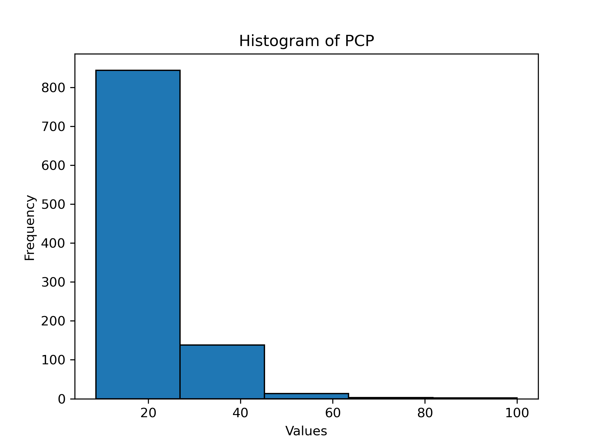
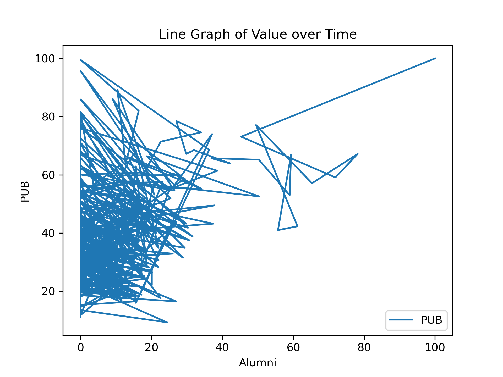

Describe:
|       |    Alumni |     Award |      Hici |      N&S |       PUB |        PCP |
|:------|----------:|----------:|----------:|---------:|----------:|-----------:|
| count | 1000      | 1000      | 1000      | 989      | 1000      | 1000       |
| mean  |    4.5096 |    3.7812 |   10.7344 |  10.5751 |   35.113  |   19.6553  |
| std   |   10.1032 |   11.4554 |   10.9493 |  10.6372 |   13.6845 |    8.80044 |
| min   |    0      |    0      |    0      |   0      |    9.3    |    8.6     |
| 25%   |    0      |    0      |    0      |   3.9    |   25.775  |   14.1     |
| 50%   |    0      |    0      |    9.2    |   7.3    |   31.7    |   17.6     |
| 75%   |    0      |    0      |   14.6    |  13.3    |   41.425  |   23       |
| max   |  100      |  100      |  100      | 100      |  100      |  100       |

